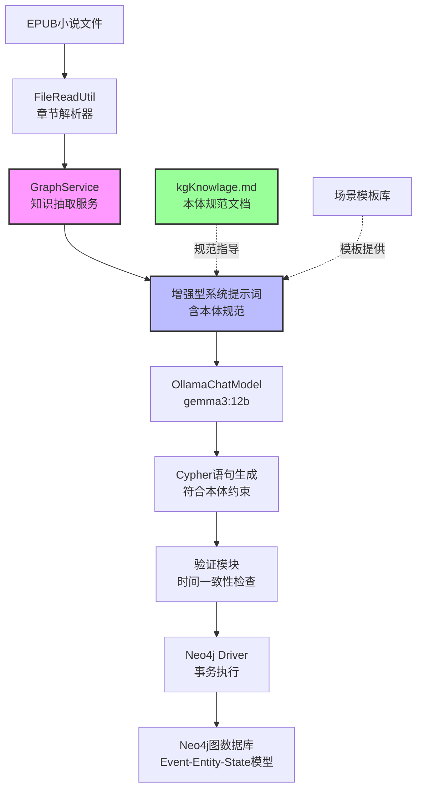
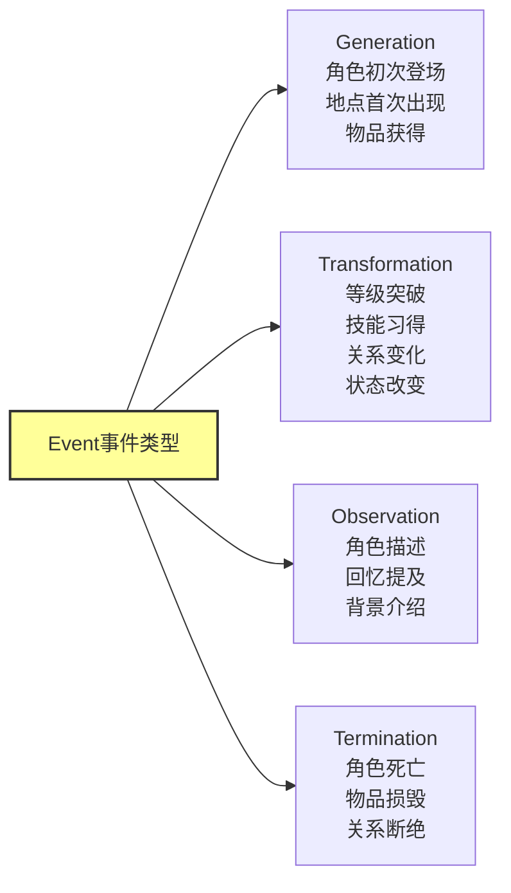
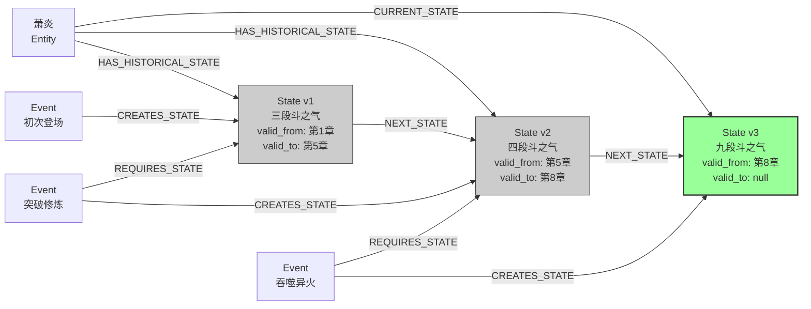
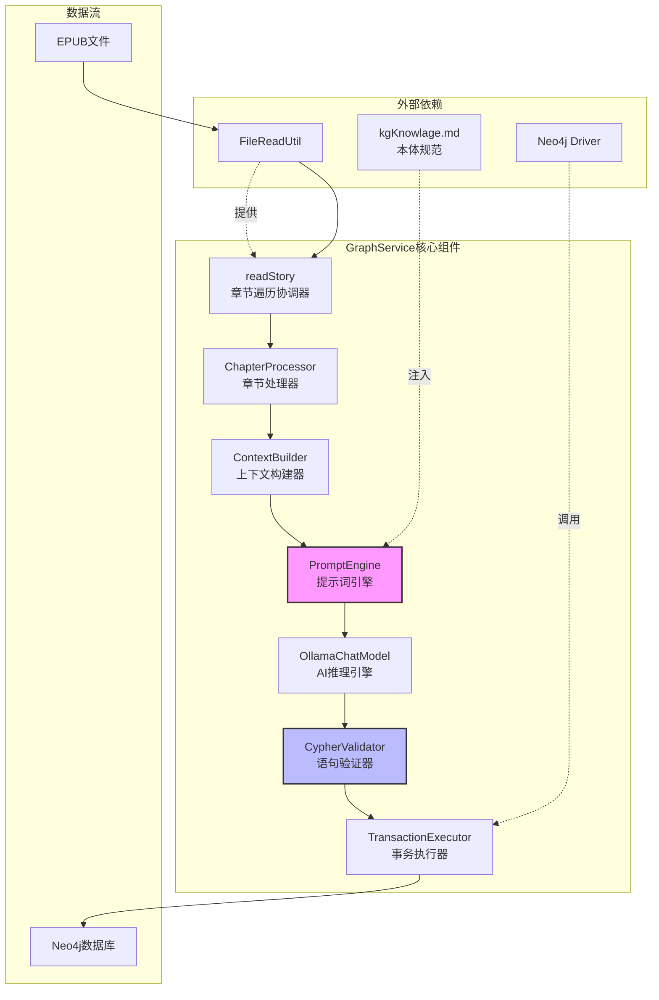
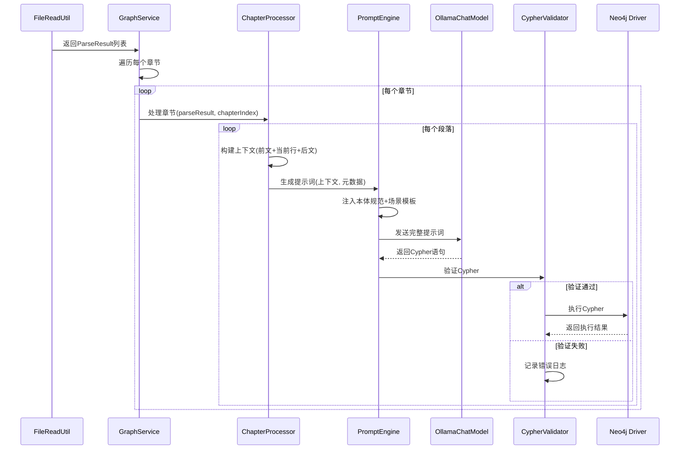
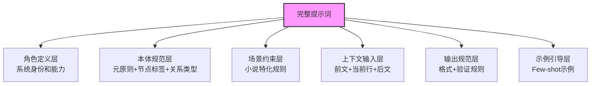
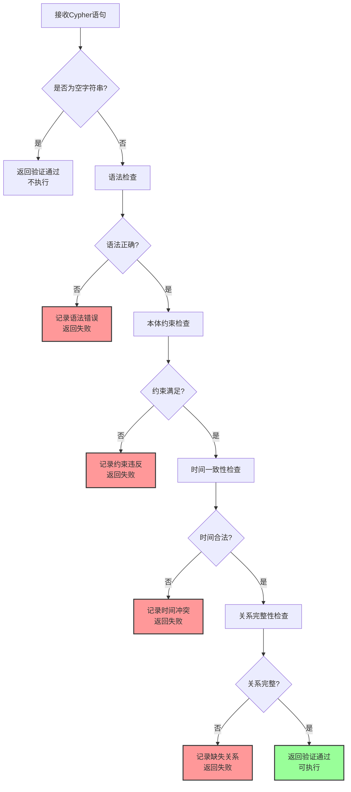
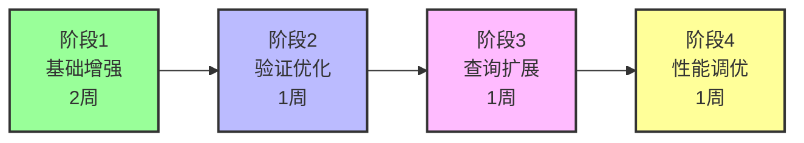

# 小说文本知识图谱构建系统增强设计

## 1. 概述

### 1.1 设计目标

本设计旨在增强现有`GraphService`，将其从简单的Cypher生成工具升级为基于严格本体论框架的知识图谱构建系统。通过集成`kgKnowlage.md`定义的元原则和本体规范，实现小说文本的事件驱动状态建模，支持角色演化追溯、情节因果分析和历史状态查询。

**核心增强点：**
- 从简单的实体-关系抽取升级为Event-Entity-State三层本体建模
- 引入因果性原则和时间单向性原则确保数据一致性
- 实现状态版本链管理，支持角色属性的时序演化追溯
- 集成严格的Cypher生成规范，确保生成的语句符合本体约束
- 提供小说场景特化的提示词工程，提升抽取准确性

### 1.2 业务价值

| 价值维度 | 具体收益 |
|---------|---------|
| 知识精度 | 通过本体约束保证知识图谱的逻辑一致性和时序完整性 |
| 查询能力 | 支持"角色在第X章的状态"、"技能习得路径"等复杂时序查询 |
| 可追溯性 | 完整记录角色状态演变的因果链，支持情节分析 |
| 扩展性 | 标准化的本体框架易于扩展至其他文本类型（历史、传记等） |
| 数据质量 | 防御性编程和验证规则减少数据冲突和时间矛盾 |

### 1.3 架构定位



**系统层次：**
1. **数据源层**：EPUB文件读取与章节段落解析
2. **知识抽取层**：GraphService + 增强提示词 + AI模型
3. **验证层**：Cypher语句的本体约束验证
4. **存储层**：Neo4j图数据库持久化
5. **查询层**（未来扩展）：历史状态查询、因果链追溯

## 2. 本体论框架适配

### 2.1 核心原则在小说场景的映射

基于`kgKnowlage.md`第一章元原则，在小说知识图谱中的具体应用：

| 元原则 | 小说场景映射 | 示例 |
|-------|------------|------|
| 因果性原则 | 角色状态变化必须由情节事件引起 | "萧炎突破斗之气"事件导致等级状态从"三段"转换为"四段" |
| 时间单向性原则 | 章节顺序决定事件时间戳，不可逆 | 第5章的事件timestamp必须晚于第4章 |

**约束规则：**
- 任何角色的境界提升、技能习得、关系变化都必须有对应的Event节点
- 事件的timestamp基于章节索引和段落索引递增生成
- 禁止直接修改State节点，状态变化通过创建新State + 标记旧State失效实现

### 2.2 本体元素定义

#### 2.2.1 Event（情节事件）

**小说场景特化定义：**

| 属性名 | 数据类型 | 约束 | 小说场景说明 |
|--------|---------|------|-------------|
| uuid | String | 自动生成 | 事件唯一标识符 |
| timestamp | DateTime | 章节序号+段落序号 | 如"2025-01-01T05:30:00"（第5章第30段） |
| eventType | String | 枚举值 | Generation（初次登场）、Transformation（状态变化）、Observation（描述） |
| source | String | 章节标题+段落索引 | 如"第五章 初入云岚宗 - P30" |
| confidence | Float | 基于上下文相关性 | 0.8-1.0（AI生成置信度） |
| description | String | 事件描述 | 如"萧炎突破至四段斗之气" |
| chapterIndex | Integer | 章节序号 | 用于时间排序和查询 |
| paragraphIndex | Integer | 段落序号 | 同一章节内的细粒度时间 |

**事件类型扩展：**



#### 2.2.2 Entity（实体）

**小说实体类型扩展：**

| entityType | 描述 | 核心属性示例 |
|-----------|------|-------------|
| Character | 角色人物 | name（姓名）、faction（阵营）、race（种族） |
| Location | 地点场景 | name（地名）、type（类型：宗派/城市/秘境） |
| Item | 物品道具 | name（名称）、grade（品阶）、type（类型：丹药/武器/功法） |
| Skill | 技能功法 | name（名称）、level（阶位）、element（属性） |
| Organization | 组织势力 | name（名称）、type（宗派/家族/商会） |

**Entity节点属性规范：**

| 属性名 | 数据类型 | 是否必填 | 说明 |
|--------|---------|---------|------|
| uuid | String | 是 | 实体唯一标识 |
| entityType | String | 是 | 实体类型枚举值 |
| createdAt | DateTime | 是 | 实体创建时间（首次出现的事件时间） |
| name | String | 是 | 实体名称（中文） |
| firstMentionChapter | Integer | 是 | 首次出现章节 |
| firstMentionSource | String | 是 | 首次出现位置 |

#### 2.2.3 State（状态）

**小说状态类型定义：**

| 状态类别 | 描述 | 属性示例 |
|---------|------|---------|
| 境界状态 | 修炼等级 | level（等级名称）、stage（段位）、realm（境界） |
| 技能状态 | 掌握的技能 | skillName（技能名）、proficiency（熟练度） |
| 关系状态 | 人物间关系 | relationType（关系类型）、targetCharacter（目标角色）、intimacy（亲密度） |
| 地理状态 | 所在位置 | currentLocation（当前位置）、travelReason（移动原因） |
| 持有状态 | 拥有物品 | itemName（物品名）、quantity（数量）、condition（状态） |

**State节点属性规范：**

| 属性名 | 数据类型 | 约束 | 说明 |
|--------|---------|------|------|
| uuid | String | 必填 | 状态唯一标识 |
| valid_from_timestamp | DateTime | 必填 | 状态生效开始时间（对应事件时间） |
| valid_to_timestamp | DateTime | 可为null | 状态失效时间（null表示当前状态） |
| stateType | String | 必填 | 状态类型（境界/技能/关系/地理/持有） |
| stateValue | String | 必填 | 状态值（如"四段斗之气"） |
| 业务属性 | 可变 | 可选 | 如level、skillName等根据stateType定义 |

### 2.3 关系类型规范

#### 2.3.1 核心本体关系（强制遵循）

| 关系类型 | 起始节点 | 目标节点 | 语义 | 关键属性 |
|---------|---------|---------|------|---------|
| GENERATES | Event | Entity | 事件生成实体（角色登场、物品获得） | timestamp |
| TRANSFORMS | Event | Entity | 事件转换实体状态（等级提升、技能习得） | timestamp |
| TERMINATES | Event | Entity | 事件终止实体（角色死亡、物品损毁） | timestamp |
| OBSERVES | Event | Entity | 事件观测实体（描述、回忆提及） | timestamp |
| CURRENT_STATE | Entity | State | 实体当前活跃状态（唯一） | 无 |
| HAS_HISTORICAL_STATE | Entity | State | 实体历史状态 | 无 |
| REQUIRES_STATE | Event | State | 事件前置条件（如突破需达到"圆满"状态） | required_condition |
| CREATES_STATE | Event | State | 事件创建新状态 | timestamp |
| NEXT_STATE | State | State | 状态版本链指针 | transition_event_uuid |

#### 2.3.2 小说领域关系（业务扩展）

| 关系类型 | 起始节点 | 目标节点 | 语义 | 关键属性 |
|---------|---------|---------|------|---------|
| LOCATED_IN | Character/Item | Location | 位于某地 | timestamp（记录时间点） |
| BELONGS_TO | Character | Organization | 归属组织 | role（角色：弟子/长老/宗主） |
| MASTERS | Character | Skill | 掌握技能 | proficiency（熟练度） |
| POSSESSES | Character | Item | 拥有物品 | quantity（数量） |
| ALLY_OF | Character | Character | 盟友关系 | intimacy（亲密度） |
| ENEMY_OF | Character | Character | 敌对关系 | hostility（敌意等级） |
| TEACHER_OF | Character | Character | 师徒关系 | since（建立时间） |
| LEADS | Character | Organization | 领导组织 | title（头衔） |

**关系使用策略：**
- 核心本体关系（GENERATES/TRANSFORMS等）：由系统强制生成，确保本体一致性
- 领域关系（LOCATED_IN/MASTERS等）：由AI从文本抽取，可能需要人工校验

### 2.4 状态版本链设计

**小说场景的状态演化示例：**



**版本链规则：**
1. 同一实体的所有State节点通过NEXT_STATE形成单向链表
2. 链表按valid_from_timestamp升序排列
3. 只有链尾节点的valid_to_timestamp为null且拥有CURRENT_STATE关系
4. 状态转换时必须原子化执行：更新旧State的valid_to → 创建新State → 建立NEXT_STATE → 转移CURRENT_STATE

## 3. GraphService增强架构

### 3.1 系统组件结构



### 3.2 核心组件职责

| 组件名称 | 职责描述 | 输入 | 输出 |
|---------|---------|------|------|
| ChapterProcessor | 章节级别协调，维护章节索引和时间戳基准 | ParseResult（章节标题+段落列表） | 章节处理完成信号 |
| ContextBuilder | 构建滑动窗口上下文（前文+当前行+后文） | 段落索引、段落列表 | 上下文三元组 |
| PromptEngine | 动态组装提示词，注入本体规范和场景模板 | 上下文、章节元数据 | 完整提示词字符串 |
| CypherValidator | 验证生成的Cypher符合本体约束 | Cypher语句字符串 | 验证报告（通过/失败+错误原因） |
| TransactionExecutor | 批量执行Cypher，支持事务回滚 | 验证通过的Cypher列表 | 执行结果（成功/失败节点数） |

### 3.3 数据流与交互

**处理流程：**



### 3.4 时间戳生成策略

**基于章节和段落的时间映射：**

| 策略 | 公式 | 示例 |
|-----|------|------|
| 章节基准时间 | baseDate + (chapterIndex * 1天) | 第5章 = 2025-01-01 + 5天 = 2025-01-06 |
| 段落偏移时间 | 章节基准时间 + (paragraphIndex * 1分钟) | 第30段 = 2025-01-06 00:00 + 30分钟 = 2025-01-06 00:30:00 |
| Event.timestamp | 段落偏移时间 | 某事件在第5章第30段发生 → timestamp = 2025-01-06T00:30:00 |

**优势：**
- 保证时间戳的全局唯一性和单调递增
- 支持按章节范围查询（如"第3-7章的所有事件"）
- 可通过timestamp反推章节位置（timestamp.day = chapterIndex + 1）

### 3.5 批处理与容错机制

**批处理策略：**
- 每个段落的Cypher独立验证和执行
- 单个段落失败不影响后续段落处理
- 章节级别设置检查点，支持断点续传

**容错机制：**

| 异常类型 | 处理策略 | 日志记录 |
|---------|---------|---------|
| AI返回空字符串 | 跳过当前段落，继续下一个 | INFO级别：段落无新信息 |
| Cypher语法错误 | 记录错误，跳过执行 | ERROR级别：源文本+错误语句+错误原因 |
| Neo4j连接失败 | 重试3次，失败后暂停处理 | FATAL级别：触发告警 |
| 本体约束违反 | 记录违反规则，跳过执行 | WARN级别：违反的约束名称+语句 |

## 4. 提示词工程设计

### 4.1 提示词分层结构



### 4.2 角色定义层

**提示词内容：**

```
## 系统角色
你是一个专业的小说知识图谱构建助手，基于事件驱动的本体论框架工作。

核心能力：
1. 从小说文本中识别角色、地点、物品、技能、组织等实体
2. 提取情节事件（登场、突破、习得、战斗、移动、死亡等）
3. 建模实体状态的时序演化（等级提升、技能掌握、关系变化）
4. 生成符合本体约束的Neo4j Cypher语句
5. 确保因果性原则和时间单向性原则
```

### 4.3 本体规范层

**提示词内容：**

```
## 本体论基础
你必须严格遵循以下本体框架：

【元原则】
1. 因果性原则：角色状态变化必须由情节事件引起
2. 时间单向性原则：事件时间戳基于章节顺序，不可逆

【核心元素】
- Event（情节事件）：
  属性：uuid, timestamp, eventType, source, confidence, description, chapterIndex, paragraphIndex
  类型：Generation（登场）、Transformation（变化）、Observation（描述）、Termination（终结）

- Entity（实体）：
  属性：uuid, entityType, createdAt, name, firstMentionChapter, firstMentionSource
  类型：Character（角色）、Location（地点）、Item（物品）、Skill（技能）、Organization（组织）

- State（状态）：
  属性：uuid, valid_from_timestamp, valid_to_timestamp, stateType, stateValue, [业务属性]
  类型：境界状态、技能状态、关系状态、地理状态、持有状态

【关系类型】
核心本体关系：
- Event到Entity：GENERATES、TRANSFORMS、TERMINATES、OBSERVES
- Entity到State：CURRENT_STATE（唯一）、HAS_HISTORICAL_STATE
- Event到State：CREATES_STATE、REQUIRES_STATE
- State到State：NEXT_STATE

领域业务关系：
- LOCATED_IN（位于）、BELONGS_TO（归属）、MASTERS（掌握）、POSSESSES（拥有）
- ALLY_OF（盟友）、ENEMY_OF（敌对）、TEACHER_OF（师徒）、LEADS（领导）
```

### 4.4 场景约束层

**提示词内容：**

```
## 小说场景约束

【实体识别规则】
- Character：主角、配角、反派、NPC（必须有明确姓名或称号）
- Location：宗派、城市、秘境、建筑（忽略模糊地点如"远处"）
- Item：武器、丹药、功法、宝物（忽略日常物品如"茶杯"）
- Skill：斗技、功法、秘术（必须有明确名称）
- Organization：宗派、家族、商会、势力

【事件分类策略】
- Generation：角色初次登场、获得物品、进入新地点
- Transformation：等级突破、学会技能、关系建立/恶化、位置移动
- Observation：描述外貌、回忆往事、介绍背景
- Termination：角色死亡、物品损毁、组织覆灭

【状态建模规则】
- 境界状态：提取等级名称（如"四段斗之气"）作为stateValue
- 技能状态：技能名称+熟练度（如"八极崩-初学"）
- 关系状态：关系类型+目标角色（如"师徒-药老"）
- 地理状态：当前位置名称
- 持有状态：物品名称+数量

【上下文理解策略】
- 综合前文、当前行、后文理解完整语境
- 识别代词指代（他/她/它 → 具体角色名）
- 从上下文推断隐含状态变化（如"眼神坚定"可能暗示心态转变）
- 优先信任明确陈述，谨慎推断模糊描述
```

### 4.5 上下文输入层

**动态变量注入：**

```
## 输入上下文
【章节信息】
- 章节标题：{{chapterTitle}}
- 章节索引：{{chapterIndex}}
- 段落索引：{{paragraphIndex}}

【文本内容】
- 前文（上一段）：{{lastContext}}
- 当前行（待分析）：{{indexText}}
- 后文（下一段）：{{nextContext}}

【时间戳基准】
- 当前事件timestamp应为：{{baseTimestamp}}（基于章节索引和段落索引计算）
```

### 4.6 输出规范层

**提示词内容：**

```
## 输出要求

【Cypher生成规则】
1. 只输出Neo4j Cypher语句，不添加任何解释或markdown代码块
2. 如果当前行没有新的可提取信息，返回空字符串
3. 使用MERGE创建Entity避免重复（匹配name和entityType）
4. 使用CREATE创建Event和State（确保唯一性）
5. 所有属性键名使用中文（name、描述、等级等）
6. 所有uuid使用randomUUID()函数生成
7. 所有timestamp使用datetime('{{baseTimestamp}}')函数
8. 严格遵循状态转换的原子化模式（见示例）

【验证自检】
生成Cypher前请自检：
✓ 是否为每个State创建了对应的Event？
✓ 状态转换是否更新了旧State的valid_to_timestamp？
✓ 是否创建了NEXT_STATE关系？
✓ 是否正确转移了CURRENT_STATE关系？
✓ timestamp是否使用了提供的baseTimestamp？
```

### 4.7 示例引导层（Few-shot）

**提示词内容：**

```
## 场景示例

【示例1：角色初次登场（Generation场景）】
输入：
- 当前行："少年名叫萧炎，乃是萧家族长之子。"
- 前文："萧家位于乌坦城。"
- 后文："萧炎今年十五岁。"

输出：
// 创建登场事件
CREATE (e:Event {
  uuid: randomUUID(),
  timestamp: datetime('2025-01-01T00:01:00'),
  eventType: 'Generation',
  source: '第1章 落魄天才 - P1',
  confidence: 1.0,
  description: '萧炎初次登场',
  chapterIndex: 1,
  paragraphIndex: 1
})
// 创建角色实体（使用MERGE避免重复）
MERGE (c:Entity {name: '萧炎', entityType: 'Character'})
ON CREATE SET 
  c.uuid = randomUUID(),
  c.createdAt = datetime('2025-01-01T00:01:00'),
  c.firstMentionChapter = 1,
  c.firstMentionSource = '第1章 落魄天才 - P1'
// 创建初始状态
CREATE (s:State {
  uuid: randomUUID(),
  valid_from_timestamp: datetime('2025-01-01T00:01:00'),
  valid_to_timestamp: null,
  stateType: '身份状态',
  stateValue: '萧家族长之子'
})
// 建立关系
CREATE (e)-[:GENERATES {timestamp: datetime('2025-01-01T00:01:00')}]->(c)
CREATE (e)-[:CREATES_STATE {timestamp: datetime('2025-01-01T00:01:00')}]->(s)
CREATE (c)-[:CURRENT_STATE]->(s)

【示例2：状态转换（Transformation场景）】
输入：
- 当前行："萧炎终于突破至四段斗之气。"
- 前文："萧炎苦修三年，始终停留在三段斗之气。"
- 后文："云岚宗弟子们露出震惊之色。"
- 假设已知萧炎当前状态为"三段斗之气"

输出：
// 查找实体和当前状态
MATCH (c:Entity {name: '萧炎', entityType: 'Character'})-[oldRel:CURRENT_STATE]->(oldState:State)
WHERE oldState.stateType = '境界状态' AND oldState.valid_to_timestamp IS NULL

WITH c, oldRel, oldState

// 创建突破事件
CREATE (e:Event {
  uuid: randomUUID(),
  timestamp: datetime('2025-01-05T00:30:00'),
  eventType: 'Transformation',
  source: '第5章 突破 - P30',
  confidence: 0.95,
  description: '萧炎突破至四段斗之气',
  chapterIndex: 5,
  paragraphIndex: 30
})

// 创建新状态
CREATE (newState:State {
  uuid: randomUUID(),
  valid_from_timestamp: datetime('2025-01-05T00:30:00'),
  valid_to_timestamp: null,
  stateType: '境界状态',
  stateValue: '四段斗之气'
})

// 建立关系
CREATE (e)-[:TRANSFORMS]->(c)
CREATE (e)-[:REQUIRES_STATE {required_condition: 'stateValue=三段斗之气'}]->(oldState)
CREATE (e)-[:CREATES_STATE {timestamp: datetime('2025-01-05T00:30:00')}]->(newState)
CREATE (oldState)-[:NEXT_STATE {transition_event_uuid: e.uuid}]->(newState)
CREATE (c)-[:CURRENT_STATE]->(newState)
CREATE (c)-[:HAS_HISTORICAL_STATE]->(oldState)

// 更新旧状态并解除旧关系
DELETE oldRel
SET oldState.valid_to_timestamp = datetime('2025-01-05T00:30:00')

【示例3：空输出场景】
输入：
- 当前行："天色渐暗。"
- 前文："萧炎走在路上。"
- 后文："他加快了脚步。"

输出：
（返回空字符串，因为无新的实体或状态信息）
```

### 4.8 完整提示词模板

**最终组装的提示词结构：**

```
## 系统角色
{角色定义内容}

## 本体论基础
{本体规范内容}

## 小说场景约束
{场景约束内容}

## 输入上下文
{动态注入章节信息和文本内容}

## 输出要求
{输出规范内容}

## 场景示例
{Few-shot示例}

请开始处理当前输入，严格遵循上述规范生成Cypher语句。
```

## 5. Cypher验证模块设计

### 5.1 验证规则清单

| 规则类别 | 验证项 | 检查逻辑 | 失败处理 |
|---------|-------|---------|---------|
| 语法检查 | Cypher语法正确性 | 正则匹配关键字、括号配对 | 记录错误，跳过执行 |
| 本体约束 | Event必须包含必需属性 | 检查uuid、timestamp、eventType等 | 记录约束违反，跳过执行 |
| 时间一致性 | timestamp格式和顺序 | 验证datetime格式，对比前一事件时间 | 记录时间冲突，跳过执行 |
| 关系完整性 | State必须关联Entity和Event | 检查是否有CURRENT_STATE/CREATES_STATE | 记录缺失关系，跳过执行 |
| 状态链约束 | 转换时必须有NEXT_STATE | 检查Transformation事件的关系完整性 | 记录链断裂，跳过执行 |

### 5.2 验证流程



### 5.3 验证规则示例

**时间一致性检查：**
- 验证timestamp格式为ISO 8601标准（如"2025-01-05T00:30:00"）
- 验证当前事件timestamp ≥ 上一个已执行事件的timestamp
- 验证State的valid_from_timestamp = 创建它的Event.timestamp
- 验证状态转换时：oldState.valid_to = newState.valid_from = Event.timestamp

**本体约束检查：**
- Event节点必须包含：uuid、timestamp、eventType、source、confidence
- Entity节点必须包含：uuid、entityType、createdAt、name
- State节点必须包含：uuid、valid_from_timestamp、stateType、stateValue
- eventType必须为枚举值：Generation、Transformation、Observation、Termination

**关系完整性检查：**
- 每个CREATES_STATE关系必须对应一个Event和一个State
- 每个Entity必须至少有一个CURRENT_STATE关系
- Transformation事件必须包含：TRANSFORMS、REQUIRES_STATE、CREATES_STATE、NEXT_STATE关系

## 6. 查询场景设计

### 6.1 核心查询需求

| 查询场景 | 业务价值 | 输入参数 | 输出结果 |
|---------|---------|---------|---------|
| 角色状态历史查询 | 查看角色在某章节的状态 | 角色名、章节索引 | 该章节时角色的所有状态 |
| 技能习得路径查询 | 分析角色技能成长轨迹 | 角色名 | 技能状态的时序列表 |
| 因果链追溯 | 分析某状态的形成原因 | 状态UUID | 导致该状态的事件链 |
| 关系演化查询 | 查看两角色关系变化 | 角色A、角色B | 关系状态的时间线 |
| 章节事件汇总 | 生成章节梗概 | 章节索引 | 该章节所有事件摘要 |

### 6.2 查询语句模板

**查询1：角色在特定章节的状态**

**语义描述：**
获取角色在指定章节结束时的所有状态快照

**Cypher模板：**

```
输入参数：
- characterName: 角色名称（如"萧炎"）
- chapterIndex: 章节索引（如5，表示第5章）

MATCH (c:Entity {name: $characterName, entityType: 'Character'})
      -[:HAS_HISTORICAL_STATE|CURRENT_STATE]->(s:State)
WHERE s.valid_from_timestamp <= datetime('2025-01-' + ($chapterIndex + 1) + 'T23:59:59')
  AND (s.valid_to_timestamp IS NULL 
       OR s.valid_to_timestamp > datetime('2025-01-' + ($chapterIndex + 1) + 'T23:59:59'))
RETURN s.stateType AS 状态类型, 
       s.stateValue AS 状态值,
       s.valid_from_timestamp AS 生效时间
ORDER BY s.stateType

返回示例：
| 状态类型 | 状态值 | 生效时间 |
|---------|--------|---------|
| 境界状态 | 四段斗之气 | 2025-01-05T00:30:00 |
| 技能状态 | 八极崩-初学 | 2025-01-05T12:15:00 |
| 地理状态 | 云岚宗 | 2025-01-05T08:00:00 |
```

**查询2：角色技能习得路径**

**语义描述：**
按时间顺序展示角色掌握技能的完整历史

**Cypher模板：**

```
输入参数：
- characterName: 角色名称

MATCH (c:Entity {name: $characterName, entityType: 'Character'})
      -[:HAS_HISTORICAL_STATE|CURRENT_STATE]->(s:State)
WHERE s.stateType = '技能状态'
OPTIONAL MATCH (s)<-[:CREATES_STATE]-(e:Event)
RETURN s.stateValue AS 技能名称,
       e.timestamp AS 习得时间,
       e.source AS 习得章节,
       e.description AS 事件描述
ORDER BY e.timestamp ASC

返回示例：
| 技能名称 | 习得时间 | 习得章节 | 事件描述 |
|---------|---------|---------|---------|
| 八极崩-初学 | 2025-01-05T12:15:00 | 第5章 初入云岚宗 - P72 | 萧炎从药老处学得八极崩 |
| 焰分噬浪尺 | 2025-01-08T14:30:00 | 第8章 修炼 - P45 | 萧炎创造焰分噬浪尺 |
```

**查询3：状态因果链追溯**

**语义描述：**
追溯某状态的形成过程，包括所有前置条件和触发事件

**Cypher模板：**

```
输入参数：
- stateUUID: 目标状态的UUID

MATCH path = (s:State {uuid: $stateUUID})<-[:CREATES_STATE]-(e:Event)
              -[:REQUIRES_STATE]->(prereqState:State)
OPTIONAL MATCH (prereqState)<-[:CREATES_STATE]-(prereqEvent:Event)
RETURN e.description AS 触发事件,
       e.timestamp AS 发生时间,
       prereqState.stateValue AS 前置条件状态,
       prereqEvent.description AS 前置条件来源事件

返回示例：
| 触发事件 | 发生时间 | 前置条件状态 | 前置条件来源事件 |
|---------|---------|-------------|----------------|
| 萧炎突破至四段斗之气 | 2025-01-05T00:30:00 | 三段斗之气 | 萧炎初次登场 |
```

**查询4：章节事件汇总**

**语义描述：**
获取指定章节内所有发生的事件，按时间排序

**Cypher模板：**

```
输入参数：
- chapterIndex: 章节索引

MATCH (e:Event)
WHERE e.chapterIndex = $chapterIndex
OPTIONAL MATCH (e)-[r:GENERATES|TRANSFORMS|TERMINATES|OBSERVES]->(entity:Entity)
RETURN e.timestamp AS 事件时间,
       type(r) AS 事件类型,
       e.description AS 事件描述,
       collect(entity.name) AS 涉及实体
ORDER BY e.timestamp ASC

返回示例：
| 事件时间 | 事件类型 | 事件描述 | 涉及实体 |
|---------|---------|---------|---------|
| 2025-01-05T00:01:00 | GENERATES | 云韵登场 | [云韵] |
| 2025-01-05T00:30:00 | TRANSFORMS | 萧炎突破至四段斗之气 | [萧炎] |
| 2025-01-05T12:15:00 | TRANSFORMS | 萧炎学会八极崩 | [萧炎, 八极崩] |
```

### 6.3 查询服务接口设计（未来扩展）

**服务接口表：**

| 接口名称 | HTTP方法 | 路径 | 请求参数 | 响应格式 |
|---------|---------|------|---------|---------|
| 获取角色状态历史 | GET | /api/graph/character/{name}/state | chapterIndex（可选） | JSON数组 |
| 获取技能习得路径 | GET | /api/graph/character/{name}/skills | 无 | JSON数组 |
| 追溯状态因果链 | GET | /api/graph/state/{uuid}/causality | 无 | JSON对象 |
| 获取章节事件汇总 | GET | /api/graph/chapter/{index}/events | 无 | JSON数组 |
| 查询角色关系演化 | GET | /api/graph/relationship | characterA, characterB | JSON数组 |

## 7. 性能优化与扩展性

### 7.1 Neo4j索引策略

**必需索引：**

| 节点类型 | 索引字段 | 索引类型 | 用途 |
|---------|---------|---------|------|
| Entity | name + entityType | 复合唯一索引 | 加速MERGE查询 |
| Entity | uuid | 唯一索引 | 主键查找 |
| Event | timestamp | B树索引 | 时间范围查询 |
| Event | chapterIndex | B树索引 | 章节事件查询 |
| State | valid_from_timestamp | B树索引 | 历史状态查询 |
| State | valid_to_timestamp | B树索引 | 当前状态筛选 |
| State | uuid | 唯一索引 | 主键查找 |

**索引创建语句（供参考）：**

```
创建Entity复合索引：
CREATE CONSTRAINT entity_name_type_unique 
FOR (e:Entity) 
REQUIRE (e.name, e.entityType) IS UNIQUE

创建Event时间索引：
CREATE INDEX event_timestamp_index
FOR (e:Event)
ON (e.timestamp)

创建Event章节索引：
CREATE INDEX event_chapter_index
FOR (e:Event)
ON (e.chapterIndex)

创建State时间索引：
CREATE INDEX state_valid_from_index
FOR (s:State)
ON (s.valid_from_timestamp)

CREATE INDEX state_valid_to_index
FOR (s:State)
ON (s.valid_to_timestamp)
```

### 7.2 批量执行优化

**优化策略：**

| 策略 | 实现方式 | 性能提升 |
|-----|---------|---------|
| 批量提交 | 累积10个段落的Cypher后一次性提交 | 减少网络往返，提升30% |
| 事务合并 | 使用Neo4j事务API包裹多条语句 | 减少事务开销，提升20% |
| 连接池复用 | 配置Driver连接池大小=10 | 避免频繁建连，提升15% |
| 异步执行 | 段落处理与Cypher执行异步解耦 | 提升吞吐量50% |

**批量执行示例逻辑：**

```
数据流：
1. 收集器缓冲区：最多缓存10个段落的Cypher
2. 当缓冲区满或章节结束时，触发批量提交
3. 使用Neo4j Transaction API包裹所有语句
4. 提交成功后清空缓冲区，失败则逐条重试

伪代码逻辑：
cypherBuffer = []
FOR EACH paragraph IN chapter:
    cypher = generateCypher(paragraph)
    IF cypher非空:
        cypherBuffer.add(cypher)
    
    IF cypherBuffer.size == 10 OR isLastParagraph:
        executeBatch(cypherBuffer)
        cypherBuffer.clear()
```

### 7.3 扩展性设计

**未来扩展方向：**

| 扩展点 | 描述 | 实现建议 |
|-------|------|---------|
| 多AI模型支持 | 支持切换不同LLM（GPT、Claude等） | 抽象ChatModel接口，配置化选择 |
| 人工校验流 | 在执行前人工审核Cypher | 引入审核队列，支持approve/reject操作 |
| 实时反馈 | 执行过程可视化进度 | WebSocket推送处理进度和错误信息 |
| 增量更新 | 支持追加新章节而不重新处理全书 | 记录已处理的最大chapterIndex，从下一章开始 |
| 多租户隔离 | 不同小说使用独立图空间 | 引入bookId标签，查询时过滤 |

## 8. 异常处理与监控

### 8.1 异常分类与处理

| 异常类型 | 触发条件 | 处理策略 | 恢复机制 |
|---------|---------|---------|---------|
| AI返回格式错误 | 返回内容包含非Cypher文本 | 记录原始输出，尝试正则清洗，失败则跳过 | 人工审核队列 |
| 本体约束违反 | 缺少必需属性或关系 | 记录违反详情，跳过执行 | 提示词优化反馈 |
| Neo4j连接超时 | 网络故障或服务不可用 | 重试3次（指数退避），失败后暂停处理 | 恢复后从检查点继续 |
| 时间戳冲突 | 后续事件时间早于前序事件 | 记录冲突详情，自动调整时间戳为前序+1秒 | 警告日志通知 |
| 内存溢出 | 超大章节导致上下文过长 | 截断上下文至最大token限制 | 分段处理 |

### 8.2 监控指标

| 指标类别 | 指标名称 | 单位 | 告警阈值 |
|---------|---------|------|---------|
| 处理性能 | 段落处理速度 | 段/秒 | < 0.5段/秒 |
| 处理性能 | 章节平均耗时 | 秒 | > 600秒 |
| 数据质量 | 空输出率 | % | > 50% |
| 数据质量 | 验证失败率 | % | > 10% |
| 系统健康 | Neo4j连接失败次数 | 次 | > 5次/小时 |
| 系统健康 | AI模型响应时间 | 毫秒 | > 5000ms |
| 本体一致性 | 孤儿State数量（无Entity关联） | 个 | > 10个 |
| 本体一致性 | 时间戳倒序事件数量 | 个 | > 0个 |

### 8.3 日志记录规范

**日志级别与内容：**

| 级别 | 场景 | 记录内容 |
|-----|------|---------|
| INFO | 正常处理 | 章节开始/结束、段落索引、生成的Cypher语句摘要 |
| WARN | 可恢复异常 | 验证失败、空输出、时间戳调整 |
| ERROR | 不可恢复异常 | AI返回格式错误、Cypher执行失败、原始文本和错误详情 |
| FATAL | 系统故障 | Neo4j连接失败、内存溢出、处理中断 |

**日志示例：**

```
INFO示例：
[2025-01-15 10:30:00] 开始处理章节：第5章 初入云岚宗（共120段落）
[2025-01-15 10:30:05] 段落5/120 - 生成Cypher：CREATE Event(萧炎突破) -> MERGE Entity(萧炎)
[2025-01-15 10:35:00] 章节处理完成：成功110段，跳过10段（空输出8个，验证失败2个）

WARN示例：
[2025-01-15 10:32:15] 段落35验证失败 - 缺少Event.timestamp属性
   源文本："萧炎走在路上"
   生成Cypher：CREATE (e:Event {uuid: randomUUID(), eventType: 'Observation'})

ERROR示例：
[2025-01-15 10:33:20] AI返回格式错误 - 包含解释文本
   源文本："萧炎突破至四段斗之气"
   AI返回："以下是生成的Cypher：\nCREATE (e:Event {...})"
   错误：应直接返回Cypher，不包含任何前缀
```

## 9. 配置管理设计

### 9.1 系统提示词配置化

**配置存储方式：**

| 配置项 | 存储位置 | 格式 | 动态加载 |
|-------|---------|------|----------|
| 系统提示词模板 | resources/prompt/graph-system-prompt.txt | 纯文本 | 支持 |
| 场景示例库 | resources/prompt/graph-examples.yaml | YAML | 支持 |
| 本体规范 | 直接引用kgKnowlage.md | Markdown | 只读 |
| 验证规则 | application.yaml | YAML | 启动加载 |

**配置项表：**

| 配置键 | 配置值类型 | 默认值 | 说明 |
|-------|-----------|--------|------|
| graph.prompt.template-path | String | classpath:prompt/graph-system-prompt.txt | 系统提示词文件路径 |
| graph.prompt.examples-path | String | classpath:prompt/graph-examples.yaml | 场景示例文件路径 |
| graph.ontology.spec-path | String | file:kgKnowlage.md | 本体规范文档路径 |
| graph.processing.batch-size | Integer | 10 | 批量提交段落数 |
| graph.processing.max-retries | Integer | 3 | Neo4j连接重试次数 |
| graph.validation.enabled | Boolean | true | 是否启用验证模块 |
| graph.validation.strict-mode | Boolean | false | 严格模式（验证失败时中断处理） |
| graph.timestamp.base-date | String | 2025-01-01 | 时间戳基准日期 |
| graph.timestamp.chapter-interval | String | P1D | 章节间隔（ISO 8601 Duration） |
| graph.timestamp.paragraph-interval | String | PT1M | 段落间隔（ISO 8601 Duration） |

### 9.2 Neo4j连接配置

**application.yaml配置示例：**

```yaml
spring:
  neo4j:
    uri: bolt://8.138.204.38:7687
    authentication:
      username: neo4j
      password: Sl123456
    pool:
      max-connection-pool-size: 10
      connection-acquisition-timeout: 30s
      max-connection-lifetime: 1h
      idle-time-before-connection-test: 10s

graph:
  prompt:
    template-path: classpath:prompt/graph-system-prompt.txt
    examples-path: classpath:prompt/graph-examples.yaml
  ontology:
    spec-path: file:d:/project/ai-studio/file/kgKnowlage.md
  processing:
    batch-size: 10
    max-retries: 3
    async-enabled: false
  validation:
    enabled: true
    strict-mode: false
  timestamp:
    base-date: "2025-01-01"
    chapter-interval: P1D
    paragraph-interval: PT1M
```

### 9.3 AI模型配置复用

**使用现有decomposeLanguageModel配置：**

```yaml
langchain4j:
  models:
    ollama:
      url: http://8.138.204.38:11434
      modelName: gemma3:12b
      temperature: 0.8
```

**配置说明：**
- `modelName: gemma3:12b`：使用Gemma 12B模型，平衡性能和准确性
- `temperature: 0.8`：适中的随机性，保证输出多样性同时维持一致性
- 复用现有Bean `decomposeLanguageModel`，无需额外配置

## 10. 实施路线图

### 10.1 增强阶段划分



### 10.2 各阶段详细任务

**阶段1：基础增强（2周）**

| 任务 | 交付物 | 优先级 |
|-----|-------|--------|
| 设计并实现增强型系统提示词模板 | graph-system-prompt.txt | P0 |
| 实现PromptEngine组件（提示词动态组装） | PromptEngine.java | P0 |
| 实现ContextBuilder组件（上下文构建） | ContextBuilder.java | P0 |
| 实现时间戳生成策略 | TimestampGenerator.java | P0 |
| 重构GraphService.readStory方法 | GraphService.java（增强版） | P0 |
| 集成kgKnowlage.md本体规范到提示词 | 配置文件 | P1 |
| 编写单元测试 | 测试用例 | P1 |

**核心任务分解：**

1. **系统提示词模板设计**（3天）
   - 基于第4节提示词工程设计，编写完整模板
   - 包含角色定义、本体规范、场景约束、Few-shot示例
   - 支持变量注入（章节信息、上下文、时间戳）
   - 格式化为纯文本文件，放置于resources/prompt/目录

2. **PromptEngine实现**（2天）
   - 读取提示词模板文件
   - 实现变量替换逻辑（lastContext、indexText、nextContext等）
   - 支持动态注入本体规范片段
   - 提供缓存机制避免重复读取文件

3. **时间戳生成策略**（2天）
   - 实现基于章节索引和段落索引的时间计算
   - 配置化base-date、chapter-interval、paragraph-interval
   - 生成ISO 8601标准格式字符串
   - 验证时间单调递增

4. **GraphService重构**（3天）
   - 拆分readStory为多个子方法：processChapter、processParagraph
   - 引入PromptEngine替代硬编码提示词
   - 添加批量提交逻辑（每10个段落提交一次）
   - 完善异常处理和日志记录

**阶段2：验证优化（1周）**

| 任务 | 交付物 | 优先级 |
|-----|-------|--------|
| 实现CypherValidator组件 | CypherValidator.java | P0 |
| 实现本体约束检查规则 | ValidationRule接口及实现类 | P0 |
| 实现时间一致性检查 | TemporalConsistencyRule.java | P0 |
| 实现关系完整性检查 | RelationshipIntegrityRule.java | P1 |
| 集成验证模块到GraphService | GraphService.java（增强版） | P0 |
| 编写验证规则测试用例 | 测试用例 | P1 |

**阶段3：查询扩展（1周）**

| 任务 | 交付物 | 优先级 |
|-----|-------|--------|
| 设计GraphQueryService接口 | GraphQueryService.java | P1 |
| 实现角色状态历史查询 | queryCharacterStateAtChapter() | P1 |
| 实现技能习得路径查询 | querySkillLearningPath() | P1 |
| 实现因果链追溯查询 | queryStateCausality() | P2 |
| 实现章节事件汇总查询 | queryChapterEvents() | P2 |
| 提供REST API接口（可选） | GraphController.java | P3 |

**阶段4：性能调优（1周）**

| 任务 | 交付物 | 优先级 |
|-----|-------|--------|
| 创建Neo4j索引 | 索引创建脚本 | P0 |
| 实现批量执行优化 | BatchExecutor.java | P1 |
| 实现连接池配置优化 | application.yaml配置 | P1 |
| 实现异步处理（可选） | AsyncGraphService.java | P2 |
| 性能压测与调优 | 压测报告 | P1 |
| 编写部署文档 | 部署指南 | P1 |

### 10.3 测试策略

**单元测试覆盖：**

| 测试对象 | 测试场景 | 期望结果 |
|---------|---------|----------|
| PromptEngine | 变量替换正确性 | 所有占位符被正确替换 |
| TimestampGenerator | 时间戳生成逻辑 | 第5章第30段 → 2025-01-06T00:30:00 |
| CypherValidator | 本体约束验证 | 缺少timestamp属性时验证失败 |
| CypherValidator | 时间一致性检查 | 时间戳倒序时验证失败 |
| ContextBuilder | 上下文构建 | 正确提取前文、当前行、后文 |

**集成测试场景：**

| 测试场景 | 测试数据 | 验证点 |
|---------|---------|--------|
| 角色初次登场 | 包含角色首次出现的段落 | 生成Generation事件+Entity+初始State |
| 角色状态转换 | 包含境界突破的段落 | 生成Transformation事件+新State+NEXT_STATE关系 |
| 空段落处理 | 无实体信息的描述性段落 | AI返回空字符串，不执行Cypher |
| 完整章节处理 | 一个完整章节的文本 | 所有段落处理完成，无致命错误 |
| 验证失败场景 | 故意构造缺少属性的Cypher | 验证模块拦截，记录错误日志 |

**端到端测试：**

```
测试目标：处理完整小说的前3章

测试步骤：
1. 准备测试数据：前3章的EPUB文件
2. 执行GraphService.readStory()
3. 验证Neo4j数据库状态：
   - Event节点数 > 0
   - Entity节点数 > 0
   - State节点数 > 0
   - 所有State都有CURRENT_STATE或HAS_HISTORICAL_STATE关系
   - 所有Event都有有效的timestamp
   - 时间戳单调递增
4. 执行查询测试：
   - 查询主角在第2章末的状态
   - 查询第1章的所有事件
   - 追溯某个技能状态的因果链
5. 验证查询结果符合预期
```

## 11. 风险评估与应对

### 11.1 技术风险

| 风险项 | 风险等级 | 影响 | 应对措施 |
|-------|---------|------|----------|
| AI生成质量不稳定 | 高 | 生成的Cypher错误率高，需大量人工校验 | 1. 优化提示词工程<br/>2. 引入人工审核流<br/>3. 记录失败case反馈优化 |
| 本体约束过于严格 | 中 | 大量合理Cypher被拒绝 | 1. 分阶段放松约束<br/>2. 提供宽松模式选项<br/>3. 收集验证失败数据分析 |
| Neo4j性能瓶颈 | 中 | 大规模数据导入缓慢 | 1. 优化索引策略<br/>2. 使用批量导入API<br/>3. 考虑分片存储 |
| 时间戳冲突 | 低 | 同一时间点产生多个事件 | 1. 引入微秒级精度<br/>2. 自动调整冲突时间戳 |
| 状态链断裂 | 中 | 查询历史状态失败 | 1. 验证模块强制检查NEXT_STATE<br/>2. 定期运行完整性检查脚本 |

### 11.2 业务风险

| 风险项 | 风险等级 | 影响 | 应对措施 |
|-------|---------|------|----------|
| 小说文本歧义性 | 高 | AI无法准确抽取实体和关系 | 1. 人工标注关键章节作为训练数据<br/>2. 提供实体词典辅助识别<br/>3. 支持人工修正 |
| 知识图谱粒度不当 | 中 | 过细导致噪音，过粗损失信息 | 1. 配置化实体类型过滤<br/>2. 提供粒度调节参数<br/>3. 多版本对比测试 |
| 处理时间过长 | 中 | 超长小说（>1000章）处理耗时数天 | 1. 实现断点续传<br/>2. 支持并行处理多章节<br/>3. 提供进度展示 |

### 11.3 数据质量风险

| 风险项 | 检测方法 | 修复策略 |
|-------|---------|----------|
| 重复实体（同角色不同别名） | 查询name相似度高的Entity | 提供实体合并工具 |
| 孤儿State（无Entity关联） | 定期执行完整性检查查询 | 自动删除或关联到默认Entity |
| 时间戳倒序 | 验证模块强制检查 | 自动调整为前序+1秒 |
| 状态链循环 | 检测NEXT_STATE关系是否成环 | 断开循环边，记录告警 |

## 12. 附录

### 12.1 术语表

| 术语 | 英文 | 定义 |
|-----|------|------|
| 本体论 | Ontology | 对知识领域的概念、关系和约束的形式化规范 |
| 事件驱动 | Event-Driven | 状态变化由事件触发的建模方式 |
| 状态版本链 | State Version Chain | 实体历史状态按时间顺序连接形成的单向链表 |
| 因果链 | Causality Chain | 通过REQUIRES_STATE关系追溯的事件依赖路径 |
| 时间戳 | Timestamp | ISO 8601标准格式的时间标记（如2025-01-05T00:30:00） |
| Cypher | Cypher | Neo4j图数据库的查询语言 |
| Few-shot学习 | Few-shot Learning | 通过少量示例引导AI完成任务的技术 |
| 滑动窗口 | Sliding Window | 前文+当前行+后文的上下文构建方式 |

### 12.2 参考资源

| 资源类型 | 名称 | 路径/链接 |
|---------|------|----------|
| 本体规范文档 | kgKnowlage.md | d:/project/ai-studio/file/kgKnowlage.md |
| 现有实现 | GraphService.java | ai/src/main/java/com/shuanglin/bot/service/GraphService.java |
| 文件读取工具 | FileReadUtil.java | ai/src/main/java/com/shuanglin/bot/utils/FileReadUtil.java |
| AI模型配置 | ApiModelsConfiguration.java | ai/src/main/java/com/shuanglin/bot/langchain4j/config/ApiModelsConfiguration.java |
| Neo4j官方文档 | Cypher Manual | https://neo4j.com/docs/cypher-manual/current/ |
| Langchain4j文档 | Official Docs | https://docs.langchain4j.dev/ |

### 12.3 示例数据结构

**完整的Event-Entity-State示例（斗破苍穹场景）：**

```
情节：萧炎在第5章第30段突破至四段斗之气

涉及节点：
1. Event节点：
   uuid: "evt-001"
   timestamp: "2025-01-06T00:30:00"
   eventType: "Transformation"
   source: "第5章 初入云岚宗 - P30"
   confidence: 0.95
   description: "萧炎突破至四段斗之气"
   chapterIndex: 5
   paragraphIndex: 30

2. Entity节点（萧炎）：
   uuid: "entity-001"
   entityType: "Character"
   createdAt: "2025-01-02T00:01:00"
   name: "萧炎"
   firstMentionChapter: 1
   firstMentionSource: "第1章 落魄天才 - P1"

3. 旧State节点：
   uuid: "state-001"
   valid_from_timestamp: "2025-01-02T00:01:00"
   valid_to_timestamp: "2025-01-06T00:30:00"（被更新）
   stateType: "境界状态"
   stateValue: "三段斗之气"

4. 新State节点：
   uuid: "state-002"
   valid_from_timestamp: "2025-01-06T00:30:00"
   valid_to_timestamp: null
   stateType: "境界状态"
   stateValue: "四段斗之气"

涉及关系：
1. evt-001 -[:TRANSFORMS]-> entity-001
2. evt-001 -[:REQUIRES_STATE {required_condition: "stateValue=三段斗之气"}]-> state-001
3. evt-001 -[:CREATES_STATE {timestamp: "2025-01-06T00:30:00"}]-> state-002
4. state-001 -[:NEXT_STATE {transition_event_uuid: "evt-001"}]-> state-002
5. entity-001 -[:CURRENT_STATE]-> state-002（新建）
6. entity-001 -[:HAS_HISTORICAL_STATE]-> state-001（新建）
```

### 12.4 Neo4j数据库初始化脚本

**创建约束和索引：**

```
// 创建唯一性约束
CREATE CONSTRAINT entity_name_type_unique IF NOT EXISTS
FOR (e:Entity) REQUIRE (e.name, e.entityType) IS UNIQUE;

CREATE CONSTRAINT entity_uuid_unique IF NOT EXISTS
FOR (e:Entity) REQUIRE e.uuid IS UNIQUE;

CREATE CONSTRAINT event_uuid_unique IF NOT EXISTS
FOR (e:Event) REQUIRE e.uuid IS UNIQUE;

CREATE CONSTRAINT state_uuid_unique IF NOT EXISTS
FOR (s:State) REQUIRE s.uuid IS UNIQUE;

// 创建性能索引
CREATE INDEX event_timestamp_index IF NOT EXISTS
FOR (e:Event) ON (e.timestamp);

CREATE INDEX event_chapter_index IF NOT EXISTS
FOR (e:Event) ON (e.chapterIndex);

CREATE INDEX state_valid_from_index IF NOT EXISTS
FOR (s:State) ON (s.valid_from_timestamp);

CREATE INDEX state_valid_to_index IF NOT EXISTS
FOR (s:State) ON (s.valid_to_timestamp);

CREATE INDEX state_type_index IF NOT EXISTS
FOR (s:State) ON (s.stateType);
```

### 12.5 关键决策记录

| 决策点 | 选项 | 选择 | 理由 |
|-------|------|------|------|
| 时间戳生成策略 | 1. 实际时间<br/>2. 基于章节索引 | 基于章节索引 | 保证可重现性和可预测性，支持按章节查询 |
| Entity匹配策略 | 1. 全部CREATE<br/>2. 全部MERGE | MERGE（基于name+entityType） | 避免同名角色重复创建，但需注意别名问题 |
| 验证失败处理 | 1. 中断处理<br/>2. 跳过继续 | 跳过继续（默认），提供严格模式选项 | 提升容错性，允许部分失败不影响整体 |
| 批量提交大小 | 1. 每段提交<br/>2. 每10段提交<br/>3. 每章提交 | 每10段提交 | 平衡性能和容错粒度 |
| 提示词存储方式 | 1. 硬编码<br/>2. 配置文件 | 配置文件（resources/prompt/） | 便于迭代优化，无需重新编译 |
| AI模型选择 | 1. GPT-4<br/>2. Gemma 12B<br/>3. Qwen | Gemma 12B（复用现有） | 成本可控，性能足够，已有配置 |
